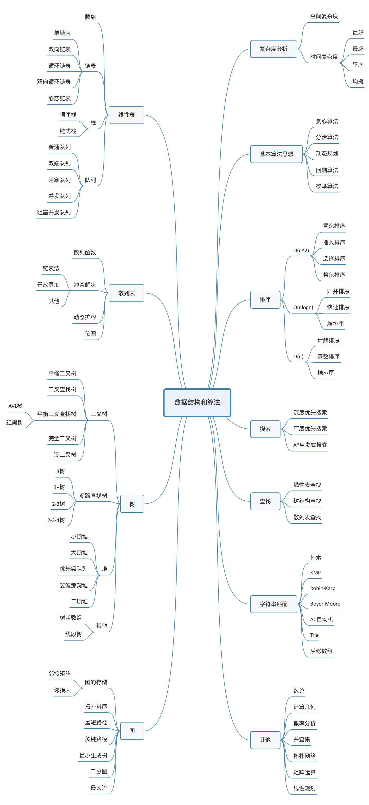

## 数据结构与算法

## Acknowledgments
-   [数据结构与算法之美](https://github.com/wangzheng0822/algo)
-   [Python数据结构与算法(视频)](https://www.bilibili.com/video/av46256220?from=search&seid=13296026210487895017)
## 线性表
n个同类型数据元素的有限序列 ,记为：L= ($a_1,a_2,...a_i,...a_n $)，记录着元素之间的一种顺序关系。根据线性表的实际存储方式，可分为 **顺序表**和**链表**。
### 顺序表

一个顺序表的完整信息包括两部分，一部分是表中的元素集合，**存储区**，另一部分是为实现正确操作而需记录的信息，即有关表的整体情况的信息，**表对象**，这部分信息主要包括元素存储区的**容量**和当前表中已有的**元素个数**两项。
顺序表的两种基本实现方式分别是**a)一体式结构** **b)分离式结构**
在Python的官方实现中，**list就是一种采用分离式技术实现的动态顺序表**。
tuple是不可变类型，即不变的顺序表
### 链表LinkList
顺序表的构建需要预先知道数据大小来申请连续的存储空间，而在进行扩充时又需要进行数据的搬迁，所以使用起来并不是很灵活。
链表（Linked list）是一种线性表，但是不像顺序表一样连续存储数据，而是在每一个节点（数据存储单元）里存放下一个节点的位置信息（即地址）。
* 单向链表
* 单项循环链表
* 双向链表

### 栈Stack
只允许在一端进行操作，后进先出 
```
stack = []
stack.append()
stack.pop()
```
### 队列Queue
只允许在一端进行插入操作，而在另一端进行删除操作的线性表，先进先出 
双端队列Deque , collections.deque() 
```
queue = []
queue.append(item)
queue.pop(0)
#根据入队出队的人数合理选择,有合适的时间复杂度
queue.insert(0,item)
queue.pop
```

## 排序与搜索
![排序比较]（img/排序比较.jpg） 
* **冒泡排序** ：比较两个相邻的元素，找最大（最小）值存放在一端 
* **选择排序** ：从未排序找最小（最大），存放在一端 
* **插入排序** ：在已排序的序列从后往前比较插入 
* **快速排序** ： 设置基准，分割成两部分，递归 
* **希尔排序** ： 设置步长，分组进行插入排序，递归 
* **归并排序** ： 分治，分解数组再合并数组，递归 

**搜索**：搜索是在一个项目集合中找到一个特定项目的算法过程。搜索通常的答案是真的或假的，因为该项目是否存在。 搜索的几种常见方法：顺序查找、二分法查找、二叉树查找、哈希查找

**二分查找** ：二分法，递归，非递归都可以实现

## 二叉树

### 二（N）叉树的深度优先遍历（DFS）
* 先序遍历（根左右）
* 中序遍历（左根右）
* 后序遍历（左右根）
```
    def preorder(self, root):
            if not root:
                return []
            self.res.append(root.val)
            for child in root.children:
                self.preorder(child)
            return self.res
```

### 二（N）叉树的广度度优先遍历（BFS）
自上而下，自左到右，层次遍历
```
def breadth_travel(self, root):
        """利用队列实现树的层次遍历"""
        if root == None:
            return
        queue = []
        queue.append(root)
        while queue:
            node = queue.pop(0)
            print node.elem,
            if node.lchild != None:
                queue.append(node.lchild)
            if node.rchild != None:
                queue.append(node.rchild)
```