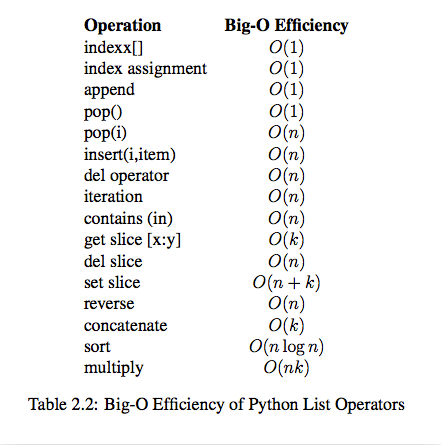

## 数据结构与算法

## Acknowledgments
-   [数据结构与算法之美](https://github.com/wangzheng0822/algo)
-   [Python数据结构与算法(视频)](https://www.bilibili.com/video/av46256220?from=search&seid=13296026210487895017)

### 复杂度分析
一、 什么是复杂度分析？
1. 数据结构和算法解决是“如何让计算机更快时间、更省空间的解决问题”。
2. 因此需从执行时间和占用空间两个维度来评估数据结构和算法的性能。
3. 分别用时间复杂度和空间复杂度两个概念来描述性能问题，二者统称为复杂度。
4. 复杂度描述的是算法执行时间（或占用空间）与数据规模的增长关系。

二、为什么要进行复杂度分析？
1. 和性能测试相比，复杂度分析有不依赖执行环境、成本低、效率高、易操作、指导性强的特点。
2. 掌握复杂度分析，将能编写出性能更优的代码，有利于降低系统开发和维护成本。

三、如何进行复杂度分析？
1. 大O表示法（渐进时间复杂度（asymptotic time complexity），）
- 来源
算法的执行时间与每行代码的执行次数成正比，用T(n) = O(f(n))表示，其中T(n)表示算法执行总时间，f(n)表示每行代码执行总次数，而n往往表示数据的规
模。
- 特点
    1. 只关注循环执行次数最多的一段代码，忽略常量、低阶、系数
    2. 加法法则：总复杂度等于量级最大的那段代码的复杂度，O(n+m)如果n和m的数量规模不同
    3. 乘法法则：嵌套代码的复杂度等于内外代码复杂度的成绩

四、 常用的复杂度级别

五、最好、最坏、平均、均摊时间复杂度分析
同一段代码，在不同输入的情况下，复杂度的量级可能是不一样，大多数情况下，是不要区别分析它们的。
均摊时间复杂度：
    - 代码在绝大多数情况下是低级别复杂度，只有极少数情况是高级别复杂度
    - 低级别和高级别复杂度出现具有时序规律。均摊结果一般都等于低级别复杂度

### 线性表
n个同类型数据元素的有限序列 ,记为：L= ($a_1,a_2,...a_i,...a_n $)，记录着元素之间的一种顺序关系。
线性表：数组、链表、队列、栈 非线性表：树 图
#### 顺序表

一个顺序表的完整信息包括两部分，一部分是表中的元素集合，**存储区**，另一部分是为实现正确操作而需记录的信息，即有关表的整体情况的信息，**表对象**，这部分信息主要包括元素存储区的**容量**和当前表中已有的**元素个数**两项。
顺序表的两种基本实现方式分别是**a)一体式结构** **b)分离式结构** 
- 在Python的官方实现中，数组**list就是一种采用分离式技术实现的动态顺序表**。 
- 连续的内存空间、相同的数据，所以数组可以随机访问(**寻址公式**)，但对数组进行删除插入，为了保证数组的连续性，就要做大量的数据搬移工作   


- 插入、删除的时间复杂度是O(n)，随机访问的时间复杂度是O(1)
- 插入删除都可以保序和非保序，非保序为O(1)
>  数组为什么从0开始编号，而不是从1开始呢？

从内存上来看：`a[i]_address = base_address + k * type_size`
#### 链表LinkList
链表（Linked list）：每一个节点（数据存储单元）里存放下一个节点的位置信息（即地址）
* 单向链表
* 单项循环链表
* 双向链表
*  链表的特点
    1. 插入、删除数据效率高O(1)级别（只需更改指针指向即可），随机访问效率低O(n)级别（需要从链头至链尾进行遍历）。
    2. 和数组相比，内存空间消耗更大，因为每个存储数据的节点都需要额外的空间存储后继指针。

- **理解指针或引用的含义**
    - 将某个变量（对象）赋值给指针（引用），实际上就是就是将这个变量（对象）的地址赋值给指针（引用）
    - p—>next = q; 表示p节点的后继指针存储了q节点的内存地址。
    - p—>next = p—>next—>next; 表示p节点的后继指针存储了p节点的下下个节点的内存地址。

- 哨兵指导思想
    - 减少特殊情况的判断，比如判空，比如判越界。空与越界可以认为是小概率情况，所以代码每一次操作都走一遍判断，在大部分情况下都会是多余的。
    - 使用哨兵的指导思想应该是将小概率需要的判断先提前扼杀，比如提前给他一个值让他不为null，或者提前预设值，或者多态的时候提前给个空实现，然后
在每一次操作中不必再判断以增加效率

典型应用：
- 数据库

#### 栈Stack
只允许在一端进行操作，先进后出，O(1)复杂度
```
stack = []
stack.append()
stack.pop()
```
典型运用：
-  浏览器的前进后退
-  括号匹配（配队）
-  表达式求值
#### 队列Queue
队列跟栈一样，也是一种操作受限的线性表数据结构。
只允许在一端进行插入操作，而在另一端进行删除操作的线性表，先进先出 
双端队列Deque , collections.deque() 
```
queue = []
queue.append(item)
queue.pop(0)
#O(1)和O(n),根据enqueue()和dequeue()次数
queue.insert(0,item)
queue.pop()
```

循环队列：避免数据搬移操作

阻塞队列：生产者-消费者模型

- 在队列为空的时候，从队头取数据会被阻塞。因为此时还没有数据可取，直到队列中有了数据才能返回；如果队列已经满了，那么插入数据的操作就会被阻塞，直到队列中有空闲位置后再插入数据

并发队列：线程安全的队列
- 会有多个线程同时操作队列，最简单直接实现方式是在enqueue()、dequeue()方法上加锁，但是锁粒度大并发度会比较低，同一时刻仅允许一个存或者取操作

典型应用：
- 在线程池等有限资源池的应用

### 递归
- 写递归代码的关键就是找到如何将大问题分解为小问题的规律（求解思路完全一样），并且基于此写出递推公式，然后再推敲终止条件，最后将递推公式和终止条件翻译成代码。
- 警惕堆栈溢出和重复计算

### 排序与搜索
* 排序算法的比较
    |  排序算法  | 概述 |  平均时间复杂度  |  是否基于比较 |稳定|
    |:-:|:-:|:-:|:-:|:-|
    |冒泡|比较两个相邻的元素，找最大（最小）值存放在一端 | O(n^2)| √|稳定|
    |插入|在已排序的序列从后往前比较插入 |O(n^2)| √|稳定|
    |选择|从未排序找最小（最大），存放在一端 |O(n^2)| √|不稳定|
    |希尔|设置步长，分组进行插入排序，递归| O(n^2)| √|不稳定|
    |快排|分治、分区，设置基准，分割成三部分，递归|O(nlogn)|√|不稳定|
    |归并|分治、分区，分解数组再合并数组，递归 |O(nlogn)|√|稳定|
    |堆||O(nlogn)|√|不稳定|
    |桶||O(n)|×||
    |计数||O(n)|×||
    |基数||O(n)|×||


**搜索**：搜索是在一个项目集合中找到一个特定项目的算法过程。搜索通常的答案是真的或假的，因为该项目是否存在。 搜索的几种常见方法：顺序查找、二分法查找、二叉树查找、哈希查找

**二分查找** ：二分法，递归，非递归都可以实现

### 二叉树

#### 二（N）叉树的深度优先遍历（DFS）
* 先序遍历（根左右）
* 中序遍历（左根右）
* 后序遍历（左右根）
```
    def preorder(self, root):
            if not root:
                return []
            self.res.append(root.val)
            for child in root.children:
                self.preorder(child)
            return self.res
```

#### 二（N）叉树的广度度优先遍历（BFS）
自上而下，自左到右，层次遍历
```
def breadth_travel(self, root):
        """利用队列实现树的层次遍历"""
        if root == None:
            return
        queue = []
        queue.append(root)
        while queue:
            node = queue.pop(0)
            print node.elem,
            if node.lchild != None:
                queue.append(node.lchild)
            if node.rchild != None:
                queue.append(node.rchild)
```