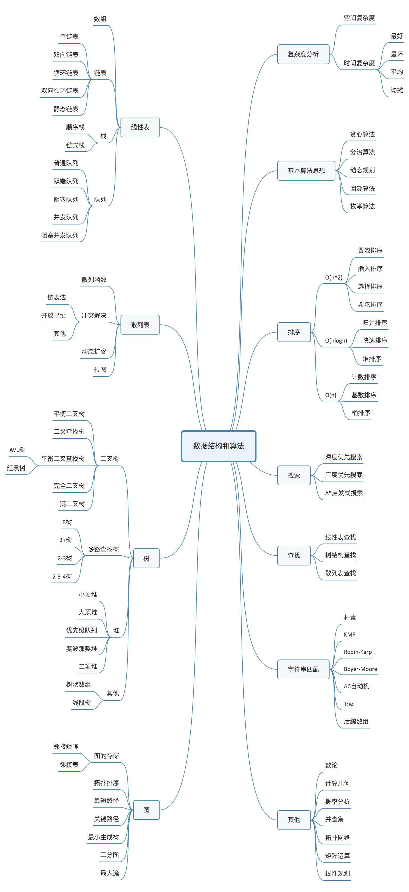
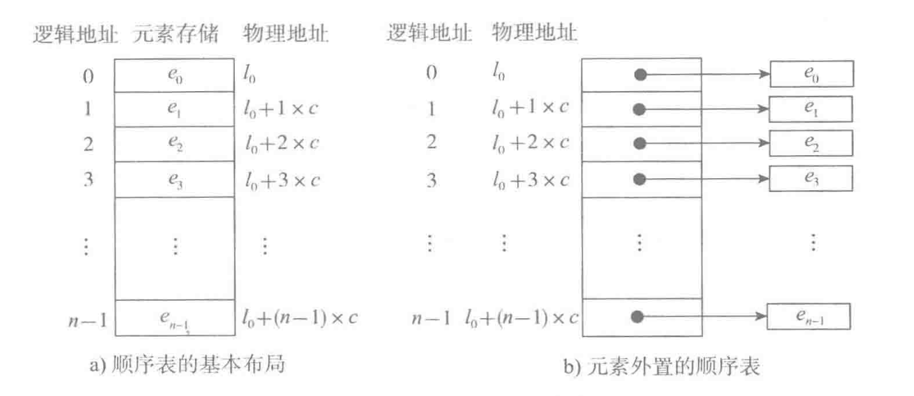

## 数据结构与算法

## Acknowledgments
-   [数据结构与算法之美](https://github.com/wangzheng0822/algo)
-   [Python数据结构与算法(视频)](https://www.bilibili.com/video/av46256220?from=search&seid=13296026210487895017)

### 复杂度分析
一、 什么是复杂度分析？
1. 数据结构和算法解决是“如何让计算机更快时间、更省空间的解决问题”。
2. 因此需从执行时间和占用空间两个维度来评估数据结构和算法的性能。
3. 分别用时间复杂度和空间复杂度两个概念来描述性能问题，二者统称为复杂度。
4. 复杂度描述的是算法执行时间（或占用空间）与数据规模的增长关系。

二、为什么要进行复杂度分析？
1. 和性能测试相比，复杂度分析有不依赖执行环境、成本低、效率高、易操作、指导性强的特点。
2. 掌握复杂度分析，将能编写出性能更优的代码，有利于降低系统开发和维护成本。

三、如何进行复杂度分析？
1. 大O表示法（渐进时间复杂度（asymptotic time complexity），）
- 来源
算法的执行时间与每行代码的执行次数成正比，用T(n) = O(f(n))表示，其中T(n)表示算法执行总时间，f(n)表示每行代码执行总次数，而n往往表示数据的规
模。
- 特点
    1. 只关注循环执行次数最多的一段代码，忽略常量、低阶、系数
    2. 加法法则：总复杂度等于量级最大的那段代码的复杂度，O(n+m)如果n和m的数量规模不同
    3. 乘法法则：嵌套代码的复杂度等于内外代码复杂度的成绩

四、 常用的复杂度级别 
 

五、最好、最坏、平均、均摊时间复杂度分析 
同一段代码，在不同输入的情况下，复杂度的量级可能是不一样，大多数情况下，是不要区别分析它们的。
均摊时间复杂度：
    - 代码在绝大多数情况下是低级别复杂度，只有极少数情况是高级别复杂度
    - 低级别和高级别复杂度出现具有时序规律。均摊结果一般都等于低级别复杂度

### 线性表
n个同类型数据元素的有限序列 ,记为：L= ($a_1,a_2,...a_i,...a_n $)，记录着元素之间的一种顺序关系。
线性表：数组、链表、队列、栈 非线性表：树 图
#### 顺序表

一个顺序表的完整信息包括两部分，一部分是表中的元素集合，**存储区**，另一部分是为实现正确操作而需记录的信息，即有关表的整体情况的信息，**表对象**，这部分信息主要包括元素存储区的**容量**和当前表中已有的**元素个数**两项。
顺序表的两种基本实现方式分别是**a)一体式结构** **b)分离式结构** 

#### 数组 
- 在Python的官方实现中，数组**list就是一种采用分离式技术实现的动态顺序表**。 
- 连续的内存空间、相同的数据，所以数组可以随机访问(**寻址公式**)，但对数组进行删除插入，为了保证数组的连续性，就要做大量的数据搬移工作   

- 插入、删除的时间复杂度是O(n)，随机访问的时间复杂度是O(1)
- 插入删除都可以保序和非保序，非保序为O(1)
>  数组为什么从0开始编号，而不是从1开始呢？

从内存上来看：`a[i]_address = base_address + k * type_size`
#### 链表LinkList
链表（Linked list）：每一个节点（数据存储单元）里存放下一个节点的位置信息（即地址）
* 单向链表
* 单项循环链表
* 双向链表
*  链表的特点
    1. 插入、删除数据效率高O(1)级别（只需更改指针指向即可），随机访问效率低O(n)级别（需要从链头至链尾进行遍历）。
    2. 和数组相比，内存空间消耗更大，因为每个存储数据的节点都需要额外的空间存储后继指针。

- **理解指针或引用的含义**
    - 将某个变量（对象）赋值给指针（引用），实际上就是就是将这个变量（对象）的地址赋值给指针（引用）
    - p—>next = q; 表示p节点的后继指针存储了q节点的内存地址。
    - p—>next = p—>next—>next; 表示p节点的后继指针存储了p节点的下下个节点的内存地址。

- 哨兵指导思想
    - 减少特殊情况的判断，比如判空，比如判越界。空与越界可以认为是小概率情况，所以代码每一次操作都走一遍判断，在大部分情况下都会是多余的。
    - 使用哨兵的指导思想应该是将小概率需要的判断先提前扼杀，比如提前给他一个值让他不为null，或者提前预设值，或者多态的时候提前给个空实现，然后
在每一次操作中不必再判断以增加效率


#### 数据结构的比较
一些非常高效的数据结构都是特定情况下基于数组和链表的结构实现的，以空间换取时间 

|数据结构|概述|变形|优缺点|CRUD|典型应用|
|:-:|:-:|:-:|:-:|:-:|:-:|
|栈Stack|先进后出|||入栈、出栈O(1)|浏览器的前进后退、括号匹配、表达式求组|
|队列Queue|先进先出|双端队列、阻塞队列、循环队列、并发队列||入队O(1)、出队O(n)，可反|在线程池等有限资源池的应用|
|跳表SkipTable|对链表建立多级索引|基于单链表实现二分查找O(logn)|空间复杂度O(n)|动态插入、删除、查找O(logn)|Redis的有序集合|
|哈希表HashTable|通过哈希函数对数组随机访问|散列表+链表，LRU缓存淘汰算法|无序、散列冲突(开放寻址法、链表法)|插入、删除、查找O(1)|字典|
|二叉搜索树Binary Search Tree|左子树小于，右子树大于||中序遍历O(n)输出有序|插入、删除、查找O(logn) ||
|红黑树Red-Black Tree|不严格的任一节点左右子树的高度相差不能大于1||性能稳定|插入、删除、查找O(logn)||
|堆树Heap|完全二叉树、每一个节点的值都必须大于等于（或小于等于）其子树中每个节点的值||数组存储节省内存、跳着访问、堆化降低有序度|插入、删除堆顶都是log(n)|TopK、优先队列、中位数| 


#### 栈Stack
只允许在一端进行操作，先进后出，O(1)复杂度
```
stack = []
stack.append()
stack.pop()
```
典型运用：
-  浏览器的前进后退
-  括号匹配（配队）
-  表达式求值
#### 队列Queue
队列跟栈一样，也是一种操作受限的线性表数据结构。
只允许在一端进行插入操作，而在另一端进行删除操作的线性表，先进先出 
双端队列Deque , collections.deque() 
```
queue = []
queue.append(item)
queue.pop(0)
#O(1)和O(n),根据enqueue()和dequeue()次数
queue.insert(0,item)
queue.pop()
```

循环队列：避免数据搬移操作

阻塞队列：生产者-消费者模型

- 在队列为空的时候，从队头取数据会被阻塞。因为此时还没有数据可取，直到队列中有了数据才能返回；如果队列已经满了，那么插入数据的操作就会被阻塞，直到队列中有空闲位置后再插入数据

并发队列：线程安全的队列
- 会有多个线程同时操作队列，最简单直接实现方式是在enqueue()、dequeue()方法上加锁，但是锁粒度大并发度会比较低，同一时刻仅允许一个存或者取操作

典型应用：
- 在线程池等有限资源池的应用


### 排序
* 排序算法的比较 

    |  排序算法  | 概述 |  平均时间复杂度  |  是否基于比较 |稳定|
    |:-:|:-:|:-:|:-:|:-:|
    |冒泡|比较两个相邻的元素，找最大（最小）值存放在一端 | O(n^2)| √|稳定|
    |插入|在已排序的序列从后往前比较插入 |O(n^2)| √|稳定|
    |选择|从未排序找最小（最大），存放在一端 |O(n^2)| √|不稳定|
    |希尔|设置步长，分组进行插入排序，递归| O(n^2)| √|不稳定|
    |快排|分治、分区，设置基准，分割成三部分，递归|O(nlogn)|√|不稳定|
    |归并|分治、分区，分解数组再合并数组，递归 |O(nlogn)|√|稳定|
    |堆||O(nlogn)|√|不稳定|
    |桶|将要排序的数据分到几个有序的桶里,每个桶里再单独进行排序，然后依次取出|O(n)|×|稳定|
    |计数|每个桶内的数据值都是相等的|O(n)|×|稳定|
    |基数|按照位数从后往前排序|O(n)|×|稳定|

    原地排序：空间复杂度是O(1)的排序算法
[代码实现](./Python/sorts.py)


### 搜索 
搜索是在一个项目集合中找到一个特定项目的算法过程。搜索通常的答案是真的或假的，因为该项目是否存在。 搜索的几种常见方法：顺序查找、二分法查找、二叉树查找、哈希查找

#### 二分查找（Binary Search） 
时间复杂度O(logN) 
递归和非递归实现 
依赖顺序表结构，按照下标随机访问元素，数组O(1)，链表O(n)
数据必须有序 

4种比较常见的二分查找变形问题
- 查找第一个值等于给定值的元素 
- 查找最后一个值等于给定值的元素 
- 查找第一个大于等于给定值的元素 
- 查找最后一个小于等于给定值的元素 
[代码实现](./Python/binary_search.py)

####　跳表
跳表使用空间换时间的设计思路，通过构建多级索引来提高查询的效率，实现了基于链表的“二分查找”。跳表是一种动态数据结构，支持快速的插入、删除、查找操作，时间复杂度都是O(logn) 
跳表的空间复杂度是O(n)
#### 散列表
Python用字典实现散列表
- 支持非常高效的数据插入、删除、查找操作,时间复杂度度为O(1) 
- 哈希函数打乱，不支持快速顺序遍历散列表中的数据 
- 散列表与链表的组合使用：LRU（Least Recently Used）缓存淘汰算法 
- 散列冲突的解决方法:开放寻址法（open addressing）和链表法（chaining） 

#### 哈希算法
将任意长度的二进制值串映射为固定长度的二进制值串
- 安全加密（hash+salt） 
- 唯一标识 
- 数据校验，签名验签 
- 散列函数 
- 负载均衡 
- 数据分片(对n取模) 
- 分布式储存(有k个机器，数据的哈希值的范围是[0, MAX]。我们将整个范围划分成m个小区间（m远大于k），每个机器负责m/k个小区间) 

### 树 
#### 二叉树  
二叉树既可以用链式存储，也可以用数组顺序存储。数组顺序存储的方式比较适合完全二叉树，其他类型的二叉树用数组存储会比较浪费存储空间 
- 二（N）叉树的深度优先遍历（DFS）
    - 先序遍历（根左右）
    - 中序遍历（左根右）
    -  后序遍历（左右根） 
-  二（N）叉树的广度度优先遍历（BFS）
    自上而下，自左到右，层次遍历 

#### 二叉搜索树（Binary Search Tree） 
二叉搜索树：在树中的任意一个节点，其左子树中的每个节点的值，都要小于这个节点的值，而右子树节点的值都大于这个节点的值
插入、删除、查找的时间复杂度为O(height)  

>  为什么要用二叉搜索树?

-   散列表中的数据是无序存储的，如果要输出有序的数据，需要先进行排序  
-  散列表扩容耗时很多，而且当遇到散列冲突时，性能不稳定
-  哈希冲突的存在，常量并不一定比logn小 

#### 平衡二叉查找树 
二叉树中任意一个节点的左右子树的高度相差不能大于1 
性能非常稳定，时间复杂度在O(logn)  

#### 红黑树（Red-Black Tree）
一种不严格平衡的二叉查找树
 - 根结点是黑色的 
 - NULL空结点都是黑色的
 - 任何相邻的节点都不能同时为红色
 - 每个节点，从该节点到达其可达叶子节点的所有路径，都包含相同数目的黑色节点 zu

左右旋只有指针的改变，其它属性保持不变，左右旋是对称的  
左旋：x结点左旋，那么y成为该子树的根结点，x成为y的左子结点，y的左子结点成为x的右子结点 

#### 递归树 
- 写递归代码的关键就是找到如何将大问题分解为小问题的规律（求解思路完全一样），并且基于此写出递推公式，然后再推敲终止条件，最后将递推公式和终止条件翻译成代码。
- 警惕堆栈溢出和重复计算 
- 如何借助树来求解递归算法的时间复杂度？ 

#### 堆(Heap)和堆排序 
堆是一种特殊的树
 - 堆是一个完全二叉树
 - 堆中每一个节点的值都必须大于等于（或小于等于）其子树中每个节点的值，分别对于大顶堆和小顶堆。 

用数组来存储完全二叉树是非常节省存储内存的   
插入一个数据和删除栈顶元素都是O(logn) 

堆排序
  - 建堆O(n)，
 - 排序O(nlog n)

>  为什么快速排序要比堆排序性能好？ 
- 快排，数据是顺序访问的，堆排序是跳着访问的，
- 堆排序的数据的交换次数多于快排，建堆对打乱顺序，导致有序度降低 

应用
 - TopK 
 - 优先队列 
 - 求中位数 

 ### 图(Graph) 
存储方式
 - 邻接矩阵 
 - 邻接表（可把链表换成平衡二叉查找树、跳表、散列表等） 

搜索方式（时间O(E)，空间O(V)）
 - 广度优先搜索（Breadth-First-Search）,层级递进，先找距离顶点最近的 
 -  深度优先搜索（Depth-First-Search）,回溯思想

### 字符串匹配 
- Brute Force,朴素匹配算法,O(n*m)，符合KISS(Keep it Simple and Stupid) 
- RK，哈希思想，理想 O(n) 
- BM，坏字符规则（bad character rule)、好后缀规则（good suffix shift），计算好后缀和坏字符往后滑动的位数，然后取两个数中最大的，作为模式串往后滑动的位数  
- KMP，好前缀规则 
- Trie树 ，查找前缀匹配的字符
串 
- AC自动机：用多模式串匹配实现敏感词过滤功能 

### 基本算法思想 
- 贪心算法 Greedy（每一步都是局部最优）
- 分治算法 Divide and Conquer （分治是思想，递归是编程技巧）划分n个规模较小的子问题（独立）
- 回溯算法
- 动态规划Dynamic Programming ，划分n个相同的问题 

### 位图与布隆过滤器 