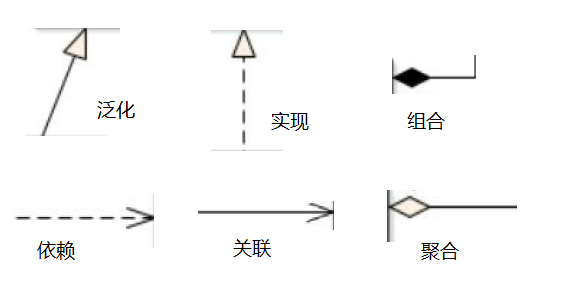

## Design Patterns  

### Acknowledge 
- 《人人都懂设计模式：从生活中领悟设计模式：Python实现》 

### Preliminary 

#### UML 
UML（Unified Modeling Language）统一建模语
言，一种由一整套图组成的标准化建模语言，用于帮助系统开发人员阐明、设计和构建软件系统。 

**类图**表示不同实体，以及彼此的关系。
该图描述了系统中对象的类型以及它们之间存在的各种静态关系，是一切面向对象方法的核心建模工具。 

类图常见的几种关系：
- 泛化（Generalization）：是一种继承关系，表示一般与特殊的关系，，它指定了子类如何特化父类的所有特征和行为。 
- 实现（Realization）：是一种类与接口的关系，表示类是接口所有特征和行为的实现。 
- 组合（Composition）：也表示整体与部分的关系，但部分离开整体后无法单独存在。因此，组合与聚合相比是一种更强的关系。 
- 聚合（Aggregation）：是整体与部分的关系，部分可以离开整体而单独存在。  
- 关联（Association）：是一种拥有关系，它使一个类知道另一个类的属性和方法。 
- 依赖（Dependency）：是一种使用的关系，即一个类的实现需要另一个类的协助，所以尽量不要使用双向的互相依赖。  

### 观察者模式（Observer） 
在**对象**间(主题Subject)定义一种一对多的**依赖**关系（观察者列表Observer）,被观察者对象在状态或内容（数据）发生变化时，所有依赖它的对象都会被通知并自动更新。 

观察者模式是对象的行为模式，又叫发布/订阅（Publish/Subscribe）模式、模型/视图（Model/View）模式、源/监听器（Source/Listener）模式或从属者（Dependents）模式。  

**观察者模式的核心思想就是在被观察者与观察者之间建立一种自动触发的关系。**  

应用场景：
- 对一个对象状态或数据的更新需要其他对象同步更新，或者一个对象的更
新需要依赖另一个对象的更新。
- 对象仅需要将自己的更新通知给其他对象而不需要知道其他对象的细节，
    - 分布式系统中实现事件服务
    - 用作新闻机构的架构
    - 股票市场也是观察者模式的一个大型场景 

[相关代码实现:热水器以及异常登陆机制](./pattern/observer.py)  

`
### 状态模式（State）
- 决定状态变化的因素也非常多，我们可以把决定状态变化的属性单独抽象成一个类StateInfo，这样判断状态属性是否符合当前的状态isMatch时就可以传入更多的信息.  
- 每一种状态应当只有唯一的实例. 

应用场景:
（1）一个对象的行为取决于它的状态，并且它在运行时可能经常改变它的状态，从而改变它的行为。
（2）一个操作中含有庞大的多分支的条件语句，这些分支依赖于该对象的状态，且每一个分支的业务逻辑都非常复杂时，我们可以使用状态模式来拆分不同的分支逻辑，使程序有更好的可读性和可维护性。

[相关代码实现:水的三种形态](./pattern/state.py) 