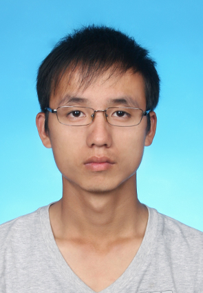

# 向维维     

- 手机：15111333275 
- Email：mr_menand@hnu.edu.cn
- QQ/微信号：mr_menand
 
# 个人信息

- 向维维/男/1995 
- 本科/中国传媒大学电子信息工程
- 硕士/湖南大学信息工程系 
- 工作年限：1年
- 技术博客：https://mrmenand.github.io/ 
- Github：https://github.com/mrmenand

# 技能清单
精通Python语言开发，熟悉Java，C++语言 
CCF : 200分 （Python实现）

以下均为我熟练使用的技能
- 自动化和运维：Python脚本和Lunix(sh)命令 
- 数据库相关：MySQL/Mongodb
- 版本管理、文档和自动化部署工具：Git  

以下均为我了解的技能
  - Django,Tornado Web 框架 
  - 微信小程序开发  

# 工作经历

## 研究生项目 

### 餐智食材分类
接手300类及800类图像分类实验模型
- 300类通过Augmentor数据增强训练模型
- 800类通过图卷积+CNN训练模型

通过这个项目，熟练用Caffe框架进行图像分类模型的开发，学会接口的测试和模型的上线，服务器部署，熟练Postman、FileZilla和Xshell等相关工具 

### 餐盘识别 
分别用Faster-RCNN、SSD和RefineDet进行餐盘图像目标检测开发，[复现笔记](https://github.com/mrmenand/Py_transaction/tree/master/Notebook) 

- 自己标注的餐盘数据数据集（18类，1017张），类别不平衡，对图片和 xml 进行数据增强  
- 拟准备用Pytorch对SGR + Deeplabv3进行开发  

## 研究方向 
 - [小样本学习](https://github.com/mrmenand/Py_transaction/blob/master/Notebook/%E5%B0%8F%E6%A0%B7%E6%9C%AC%E5%AD%A6%E4%B9%A0.md )，Few-shot Learning , 图卷积（GNN） 
 -  目标检测，图像分类 

    
# 开源项目和作品
<!-- ## 技术文章

## 演讲和讲义 -->

## 开源作品
- [Py_transaction](https://github.com/mrmenand/Py_transaction) : 用Python（Java）从底层实现数据结构和算法、Leetcode刷题记录、Notebook(Python高级编程技巧、数据可视化、Linix命令及自动化等) 
- [Spider_Man](https://github.com/mrmenand/Spider_Man) : 爬虫学习时的一些项目，有三种方式爬取蜂鸟网和[每日情话](https://github.com/mrmenand/Spider_Man/tree/master/Words_to_mygirl) 

- [ToolBox](https://github.com/mrmenand/ToolBoxs) : 处理学习过程的一些工具 

    
