## Background 
Dilemma of Large-scale Suppevised 
### Problems 
1. No memory:Knowledge learned is not retained 
   - Knowledge is not cumulative 
   - Cannot learn by leveraging past learned knowledge  
   - for many rare classes , collecting a large number of training samples is infeasible or even impossible  
   
2. Needs a large number of training example  
   - Human  can learn  effectively from a few example 
   - Human can learn to learn  
### What we want ? Learn as humans do. 
1. Humans have  the ability  to  recognize without seeing  example(zero-shot problem  )

2. Retain learned knowledge from  previous  task & usu  it to  help future learning(transfer learning ) 

## Few-Shot learning  
Few-shot  learning  aims to learn information about object categories from ***one,or only a few***,traning images.  

### Outlines of Few-shot learning   

####  1. Directly supervised   learning-based approach   

do not auxiliary data 
 directly learn one-shot classier   
- Instance -based learning  
- K-nearest neighbor  
- None-parameter methods 

#### 2. Transfer learning-based approaches:

Use knowledge from auxiliary data 
The  paradigm of <b> *learning  to  learn or  meta learning* </b>

- Attribute-based  algorithms  
- Meta-learning algorithms  
- Metric-larning  algorithms  
     - Matching Net  
     - Proto Net 
     - Relation Net  

#### 3. Data Augmentation for  One-shot Learning   

1.  Learning  one-shot models by utilizing the manifold information  of large amount  unlabelled data in semi-supervised  or transductive setting   

2. Adaptively learning  the one-shot classifier from off-shelf trained models 

3. Borrowing  example from relevant categories or semantic vocabularies to augment to  training  the  tranning set  

4. Synthesizing new labelled training by rending vital example or  composing  synthesized representations or  distort traning examples  

5. Generating new  examples using  Generative  Adversarial Networks(GANs) 

6. Attribute-guided augmentation(AGA) to synthesize sample at desired values or strength  

###  Meal80K Dataset 
   -  Includes 424 categories, a total of 81,734 images, with noise in real scenes 
   - Among them, 36 categories are less than 20, and 23 categories are less than 10 
   - In the real electronic receiving environment, the picture may have different light and dark environments, accompanied by other artificial noises such as bags and hands and feet. 
   - Most of the public data sets are relatively clean and evenly distributed. 

#### Distribution relationship of Meal80K 
- Some classes(eg.chili ,melon,leafy vegetables et.al) are semantically or visually similar.
- Thus it is reasonable to assume that there are correlations between their classification weight vectors that could be exploited in order to reconstruct a more discriminative  classification weight vector for each of them

###  How to we reconstruct Few-shot problem on Meal80K datasets with noise?

#### Generating Classification Weight with GNN for K(zero/few)-Shot  Learning   based on Meal80K  

- Given an initial recognition model already trained on a set of base classes, the goal of this work is to develop a meta-model for few-shot learning 
- given as input some novel classes with few training examples per class(K=1,2,5,10,20...), must properly adapt the existing recognition model into a new model that can correctly classify in a unified way both the novel and the base classes  

#### It is very difficult to establish attribute description in the Meal80K datasets and thers exist a problem of domain drift. 
It is very suitable to establish a suitable mapping through AutoEncoder to get the semantic weight of each category(word embedding). 

#### Graph Neural Network based Denoising Autoencoder
- the DAE framework prescribes to apply Gaussian noise on some target weights and then train the DAE model r(.) to  reconstruct them. 
- take into account the inter-class relationships when reconstructing the classification weights of a set of classes(GNN) 

# Related Papaer Reading(Low-Shot,Generalized FSL )  
- Low-Shot  : a more practical yet challenging FSL setting ,call  generalized  FSL,where the label space  of  test data is extend to  both and novel classes  
- Aims  : learn a  classifer for the novel classes with few  shots by transferring knowledge from the based classes  

## 1. Few-Shot Learning with Global Class Representations 

### Introduce 
- Most existing FSL approaches are based on meta training 
    - good initialcondition 
    - embedding  
    - optimization strategies  
- the  model are mostly learned with the source data only , no guarantee for the model to generalize well  on the target data   

- Global representation : the represrntation is learn jointly using both base and novel class training samples  
   - A critical obstacle : the imbalanced training sample numbers across the base an novel classes  
    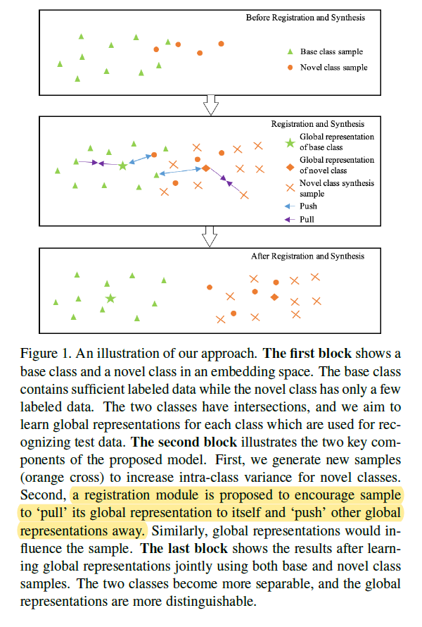
   - use sample synthesis to increase the intra-class variation for the novel class  
       - by randomly sampling data points from a subspace of samples in the same classes  
   -  episode training to balance the base and novel class samples. 
       - episodic class mean : support set via registration module 
       - classification loss : query set   
       -  registration  module  forces each data to pull the global rep resentation of its class toward itself and push other global representations away in the embedding space    

### Methodology  
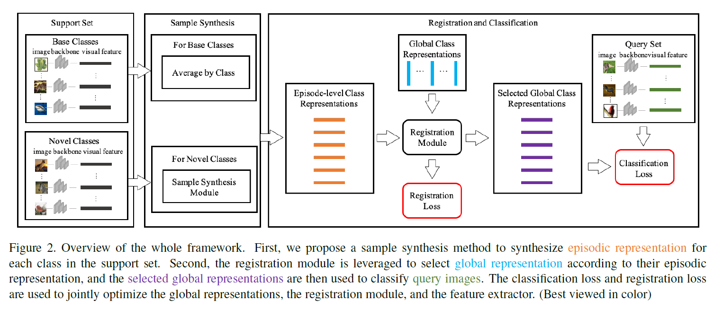

TODO 
 先看完第二篇在回来看

##  2. Low-Shot Learning from Imaginary Data  
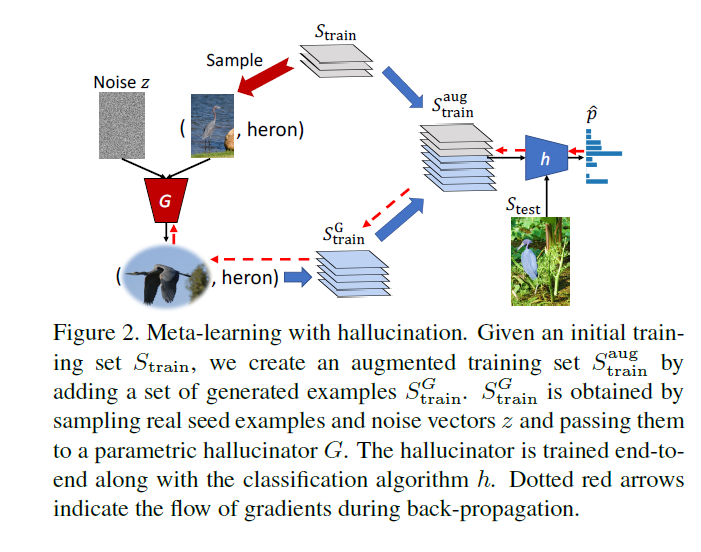  

TODO: 需要对比 Low-shot Learning by Shrinking and Hallucinating Features

## 3.  Generating ClassificationWeights with GNN Denoising Autoencoders for Few-Shot Learning 

- implement the DAE model as a Graph Neural Network  
- Goal : train model to learn to adapt the above recognition model to a set of novel classes(few example),while at the same time maintaining the recognition performance on the base classes 

### DAE based model parameters generation 
- takes as input a set of classification weights corrupted with additive Guassian Noise ,  and learns to reconstruct the target-discriminative classification weights 

-  the injected noise helps in the regulations to avoid the danger of overfitting on the training data  

- computing the difference between the input weights and the reconstructed weights  

### Building the model parameters DAE as a Graph Neural Network  

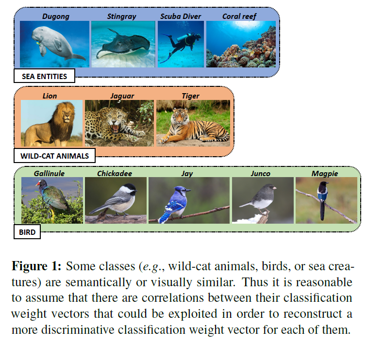

not  consider any side-information(i.e.,knowledge graphs or word-embedding),which make more agnostic to the domain of problem   

### Methodology  

- cosine similarity-based feature classifers : better performance in low-shot task (already L2 normalized )

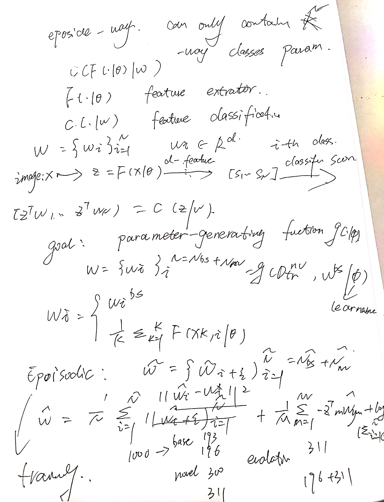
#### Denoising Autoencoders for model parameters generation  
- injected Guassion noise : avoiding overfitting  
- interatively refining some initial (but not very accurate ) estimate of the weight in a way moves thems to more probable configuration 
-  DAE learns a vector field pointing towards the manifold where the input data lies  

#### Episodic training of classification weights DAE model 
- form training episodes by sampling $\tilde{N_{nv}}$ "fake" novel classes from the available $N_{bs}$ class in the traning data  $D_{tr}^{bs}$ and ues the remaining $\tilde{N{bs}} = N_{bs}-\tilde{N_{nv}}$  

###  Graph  Neutral Network based Denoising Autoencoder  

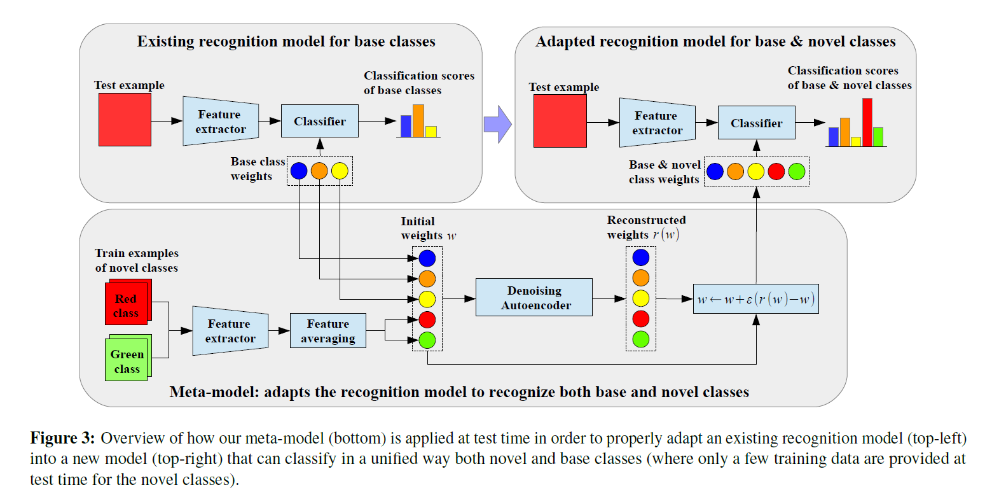

- connect each class i with its $J^2$ closet classes in terms of the consine-similarity of the initial estimates of their classification weight vectors(before the injection of the Guassian noise ) 
- AGGREGATE : $h_{N (i)}^{(l)} = AGGREGATE({h_j^{(l)}},\forall_j\in N(i))$
- UPDATE : $h_i^{(l+1)} = UPDATE(h_i^{(l)},h_{N (i)}^{(l)})$
- COMBINE 

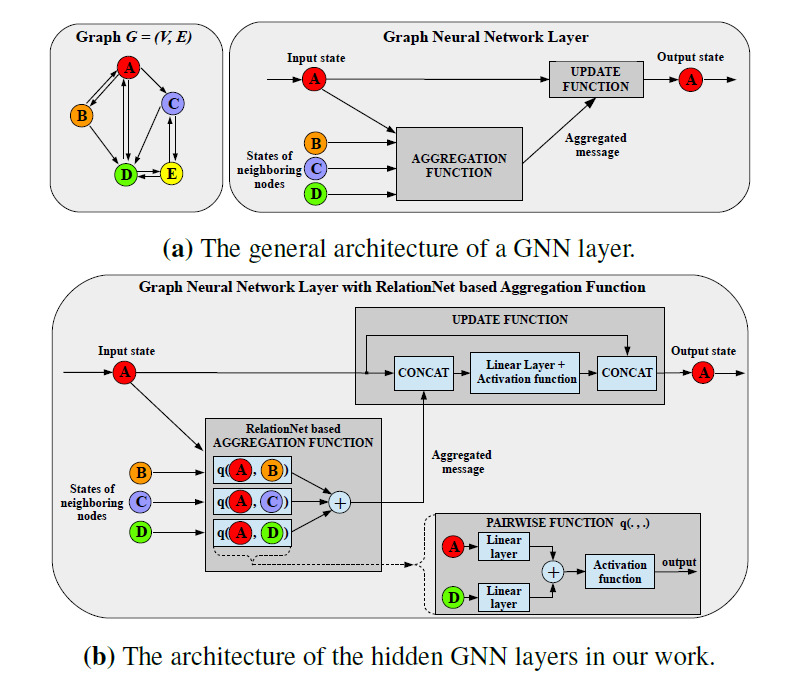 

#  Related Paper  Reading (Few-Shot)

## 1. FEW-SHOT LEARNING WITH GRAPH NEURAL NETWORKS 

###  few-shot learning tasks 
- the ability to learn from few examples 
- Rather than relying on regularization to compensate for the lack of data, researchers have explored ways to leverage a distribution of similar tasks, inspired by human learning
- supervised learniing setup(meta-learning)  
- a supervised task-driven message passing algorithm. 
- cosine distance  

### Model 
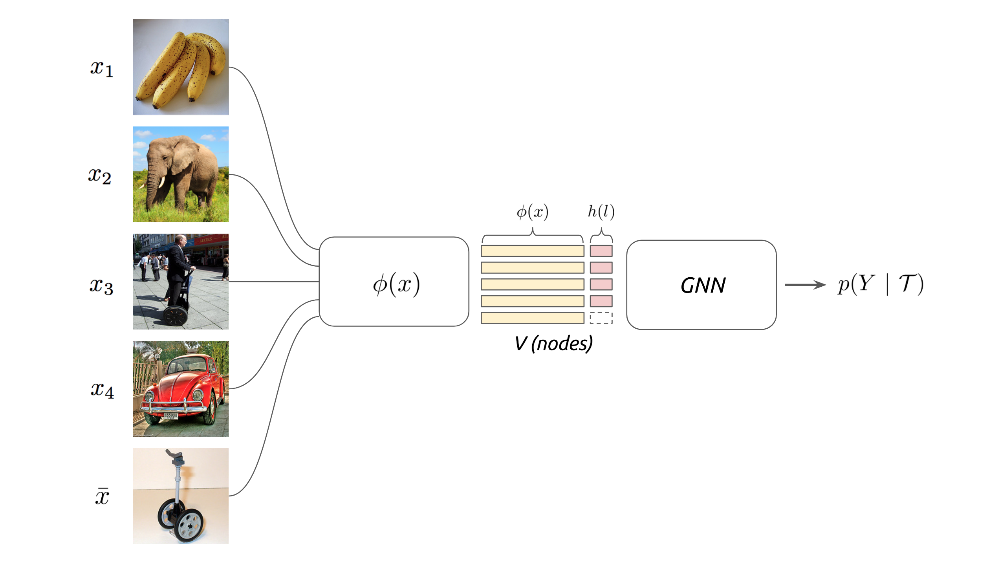

edge feature $\tilde{A^{k}}$ from the current node hidden representation   

$$\tilde{A_{i,j}^{k}= \varphi_{\tilde{\theta}}} (x_i^{k},x_j^{k})=MLP_{\tilde{\theta}}(abs(x_i^{k},x_j^{k}))$$  

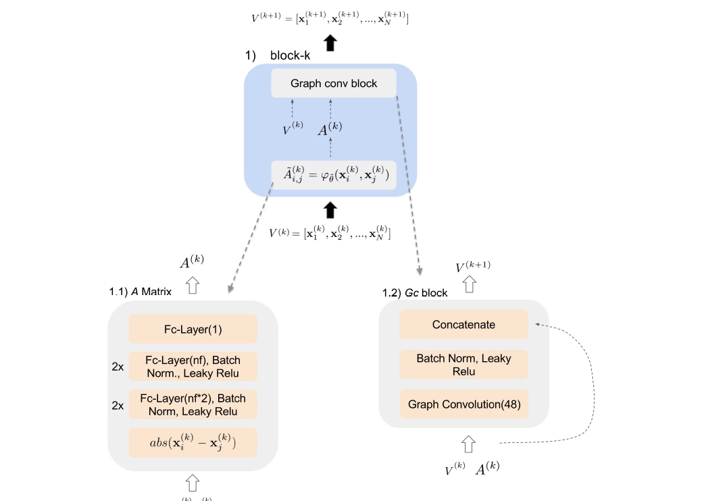 

## 2. A CLOSER LOOK AT FEW-SHOT CLASSIFICATION 
  - intra-class variation(fine-grained,like CUB ) not as critical  when  using deeper backbones 
  -  realistic cross-domain evaluation setting(like miniImageNet)  

### Introduction 
   - data hungry: abundant labeled instances with diverse visual variations 
   - scarcity of  data in some classes (e.g..,rare  sspecies) 
   - meta-learning  paradigm where transferable knowledge is extracted and propagated from  a collection of  tasks to prevent overfitting and improve  generalization   
   - method overview  
      - Initialization based  methods 
          - learning to fine-tune  
          - learning  an optimizer   
      - Distance  metric learning  based methods  
          - learning to compare 
              - cosine similarity (like ,attention-based mechanism )
              - Euclidean distance   
              - CNN-based relation module 
              - ridge regression 
              - graph neural network   
      - Hallucination based methods  
          - learning  to  augment 
          - learns  a generator  from data in the  base classes  and  use  the  learned generator to  hallucinate  new class data from data  augmentation   
      - Domain adaption   
          - reduce the  domain  shifts  between  source  and  target  domain  
          - one-shot novel  category domain adaptation problems(QAQ) 

   -  Limitations 
      - The  discrepancy  of  the implementation details among multiple few-shot learning algorithms obscures the relative  performance gain .
      -  Baseline  approach  can  also be significantly under-estimated(e.g.. training without data augmentation)  
      - The lack of domain shift between the base and novel classes makes the evaluation scenarios unrealistic. (QAQ )  

  - use of a shallow  backbone commonly  use  in  existing  work leads to favorable results for methods that  explicitly  reduce  intra-class variation   

  - base and novel classes are sampled from different domains.(QAQ)  

###  Overview of  Few-Shot Classfication  Algorithms  

####  BaseLine 
the classifiemakes a prediction based on the cosine distance between the input feature and the learned  weight vectors representing each class.

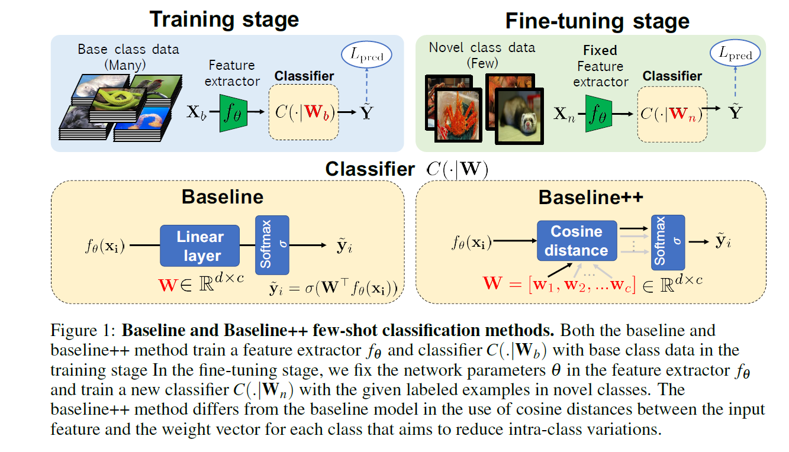 

#### Meta-Learning Algorithms 
a few-shot classification methods as meta-learning  if  prediction  is  conditioned on  a small  support  set  S,because  it makes the training  procedure  explicitly  learn to  learn  from a given small support  set. 

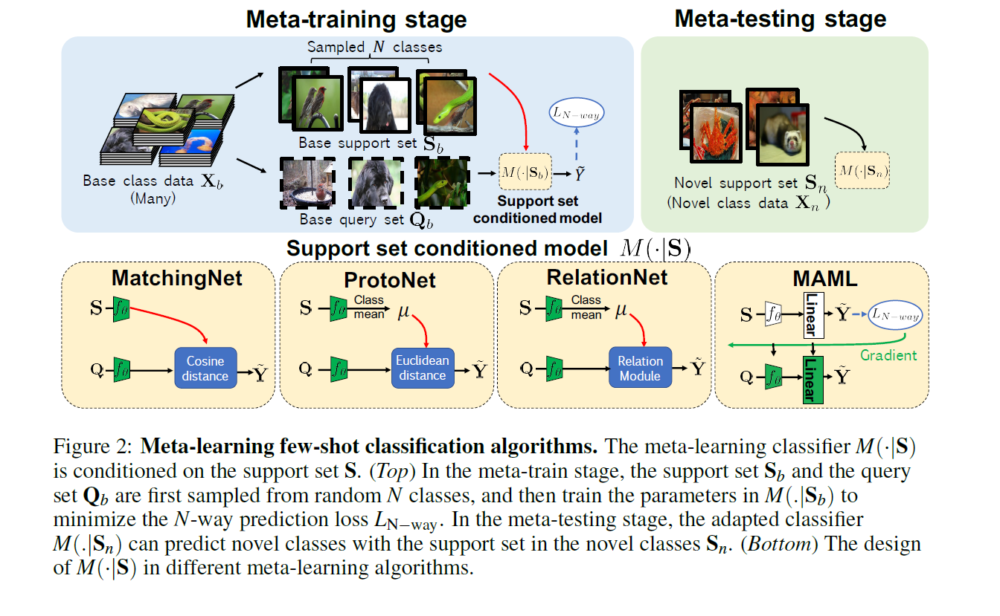 

## 3. Edge-Labeling Graph Neural Network for Few-shot Learning 
[一篇比较好的论文解读](https://blog.csdn.net/weixin_39505272/article/details/90613454)
- learns to predict the edge-labels rather than the  node-label  on the graph 
- iteratively updating edge-labels with exploitation of both intra-cluster similarity and inter-cluster dissimilarity. 

### Introduction  
- GNNs iteratively perform a feature aggression from neighbors  by message passing , and therefore  can express complex interactions  among  data instances  

- few-shot learning algorithms have shown to require full exploitation of  the relationships  between a  support set  and a  query set  

### Edge-Labeling Graph 
- Correlation clustering  is a  graph-partioning algorithm that infers the edge label by  simultaneously maximizing intra-cluster similarity and inter-cluster dissimilarity . 

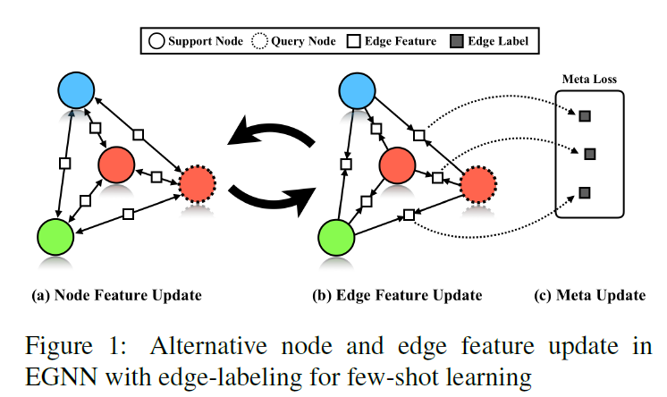 

### Problem Define : Few-shot Classification  
-   few-shot  learning aims to automatically and  efficiency solve new  tasks with few labeled data based on knowsledge from previous experience  
- a small number of  labeled support samples for each task are not sufficient  to train a model fully reflecting  the inter - and intra-class variations (*论文潜在点，通过DAE或者对抗性学习，提高拟合能力* )  

### Episodic  training   
  - meta-learning 's purpose is to learn a lot of  tasks 
  - one  episodic  equal one training  task 
 
### Model  
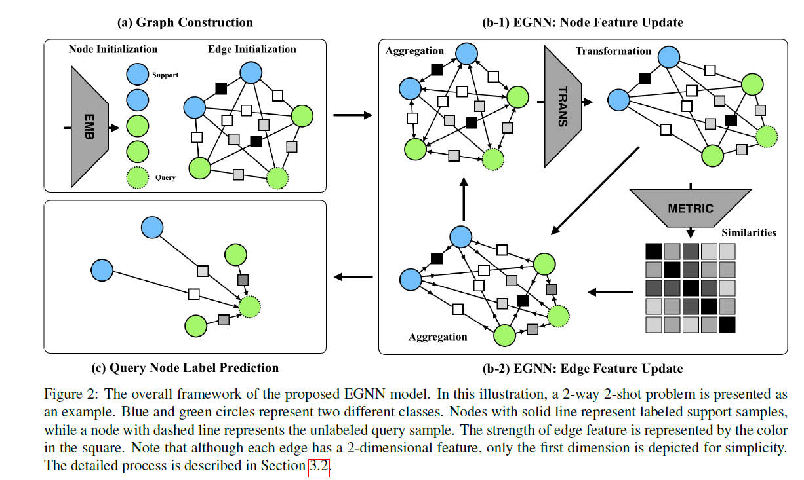 

## 4. Meta-Learning: from Few-Shot Learning to Rapid Reinforcement Learning  

###  Question Setting 
 - What  if you don't  have a large dataset ?
 - What if you want a general -purpose AI system in the real world ? 
    - Need to continuously adapt and learn on the job.
    - Learning each thing from scratch wont cut it .  
    - To avoid the effect of  class imbalance  and inter-class and intra-class relationship ,The robustness of the model is not well solved by tricks like data enhancements 

- what if your  data has a long tail ? (QAQ) 

### Problem define 

- Supervised learning 
   

- Meta-learning problem 
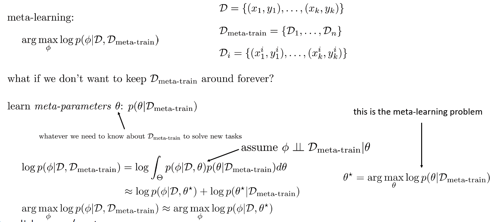

- how do we train this thing?
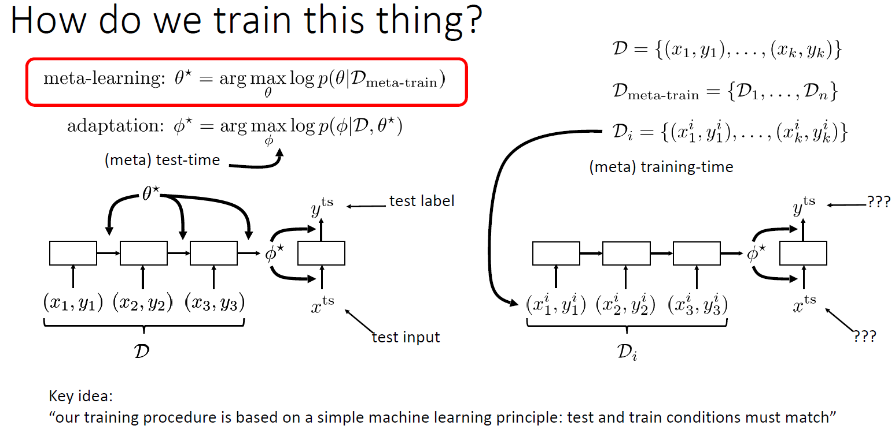 

- N-Way K-shot 
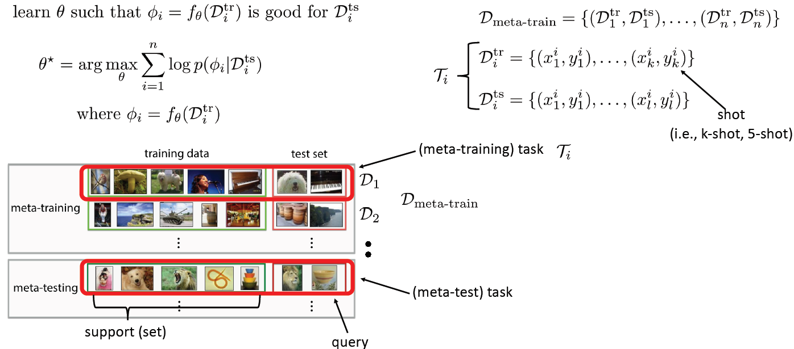

- Optimization-Based Inference 
   - key ideas: over many tasks, learning parameter vector $\theta $  that transfer via fine-tuning   
   

## 5. HOW POWERFUL ARE GRAPH NEURAL NETWORKS ?

- GNNs follow a neighborhood aggregation sheme ,where the representation vector of a node 
- the class of GNNs and is as powerful as the Weisfeiler-Lehman Graph isomorphism test (图同构测试,asks whether two graphs are topologically
identical )   
- GNNs are are at  most as  powerful as  the  WL test in  distinguish graph structure  
- Graph structure that  cannot be distinguished by popular GNN variants,such  as GCN , GraphSAGE  

-  Weisfeiler-Lehman (WL) test
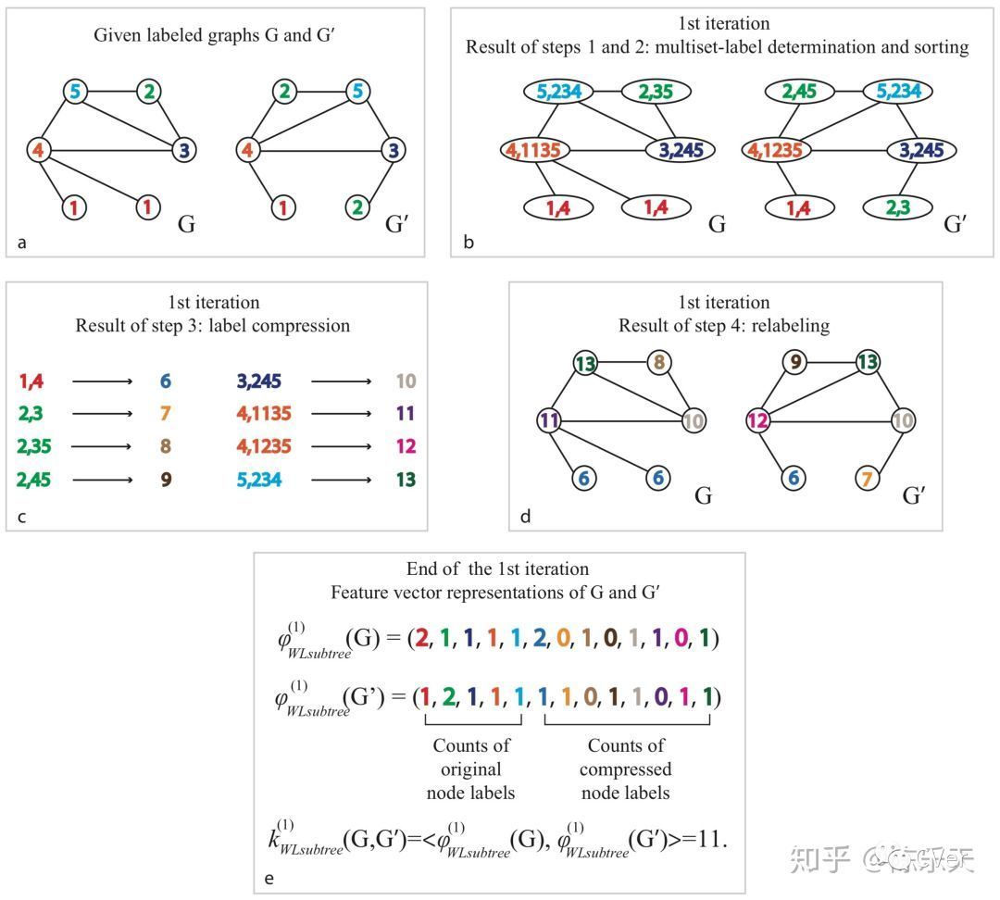

### Introduction       
- the design of new  GNN is mostly based on empirical intuition ,heuristic, and experimental trail-and-error 
- three is little theoretical understanding of the properties and limitations of  GNNs, and formal analysis of GNNs' representation is limited   
- to aggregate different multiset into different representation  

### Building Powerful Graph Neural Network  

- a maximally powerful GNN could  distinguish different graph  structure by  mapping them to different representation in the embedding space  

- a slightly weaker criterion : a powerful heuristic called *Weisfeiler-Leman(WL) graph isomorphism test* 

- if the neighbor aggregation and  graph-level readout function are injective(单射),then resulting GNN is as powerful as the  WL test   
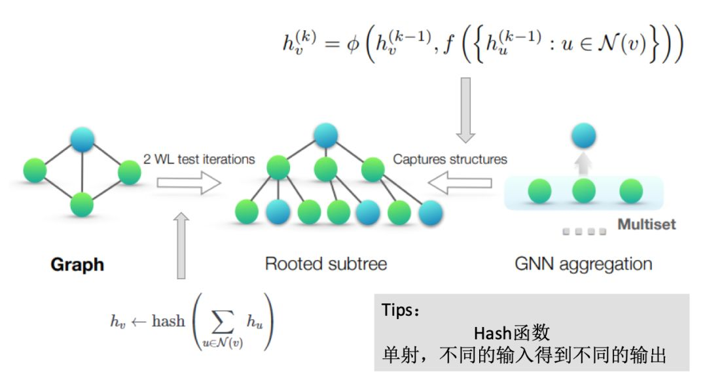

- GNNs not only discriminate different structure ,but  also to  learn to map similar graph  structure to similar embedding and capture dependencies between graph structure  

### GIN updates node representationsos 

$$h_v^{(k)} = MLP\left( (1+\epsilon ^ k)\cdot h_v^{k-1} + \sum_{u\in N(v)} h_u^{k-1} \right)$$

## Zero-Shot learning 
Zero-shot recognition uses textual or attribute-level descriptions of object classes to train classifiers. 
### ZSL  Problems 
1. Domain Shift  
   -  The same attribute, the visual characteristics may be different in different categories.
2. Semantic Gap  
   - The manifold (distribution structure) formed in the feature space is inconsistent with the manifold formed by the sample in the semantic space. 

#### Word Embeddings and Knowledge Graph  

### Schedule  

-  The classification model has produced 2.2T of data in real scenes, for a total of 18 million images 
   - Filtering ,Reconstruct  Meal Datasets   
   - Noise label(wrong label )

- Deployment 
    - Tornado (using non-blocking network I/O)  