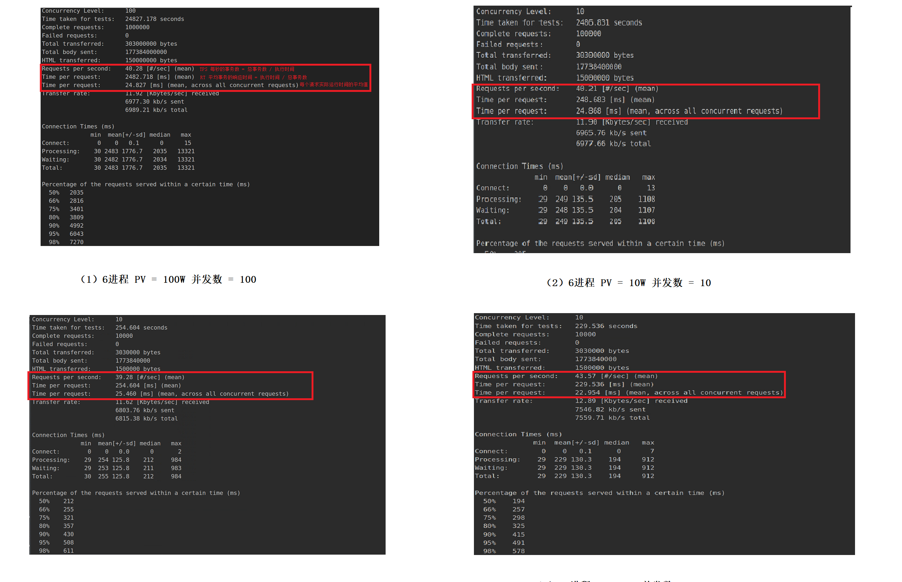

# 高并发 

##  Preliminary

**PV(访问量)：**即Page View, 即页面浏览量或点击量，用户每次刷新即被计算一次。
**UV(独立访客)：**即Unique Visitor,访问您网站的一台电脑客户端为一个访客。00:00-24:00内相同的客户
端只被计算一次。
**IP(独立IP)：**即Internet Protocol,指独立IP数。00:00-24:00内相同IP地址之被计算一次。  

**QPS（每秒查询）**：Queries Per Second意思是“每秒查询率”，是一台服务器每秒能够相应的查询次数 。

**TPS（每秒事务）**：是TransactionsPerSecond的缩写，也就是事务数/秒。一个事务是指一个客户机向服务器发送请求然后服务器做出反应的过程。  

**RT(响应时间)**：执行一个请求从开始到最后收到响应数据所花费的总体时间,即从客户端发起请求到收到服务器响应结果的时间 

**并发数**：并发数是指系统同时能处理的请求数量 

**吞吐量** ：系统的吞吐量（承压能力）与request对CPU的消耗、外部接口、IO等等紧密关联。单个request 对CPU消耗越高，外部系统接口、IO速度越慢，系统吞吐能力越低，反之越高。系统吞吐量几个重要参数：QPS（TPS）、并发数、响应时间。

   1.  QPS（TPS）：（Query Per Second）每秒钟request/事务 数量 
   1.  并发数 ： 系统同时处理的request / 事务数  
   1.  响应时间 ： 一般取平均响应时间  

有如下关联 ：（TODO  // 不是很清楚）

- QPS（TPS） = 并发数 / 平均响应时间 
- 并发数 = QPS * 平均响应时间  

​	

##  案例分析  

按二八定律来看，如果每天 80% 的访问集中在 20% 的时间里，这 20% 时间就叫做峰值时间。 

-  公式：( 总PV数 * 80% ) / ( 每天秒数 * 20% ) = 峰值时间每秒请求数(QPS) 
- 机器：峰值时间每秒QPS / 单台机器的QPS = 需要的机器   

1. **假设深度学习服务的单台机器PV的为100W, 这台机器需要多少QPS ?**  

      (1000000 * 0.8 )  / (86400 * 0.2 )  = 47 (46.3) QPS   

2.  **如果一台机器的QPS是35，需要几台机器来支持** 

   ​	47 / 35 = 2   

##  如何计算一个 服务的 QPS（TPS）？

常用的压力测试工具有Load runner ， Jmeter , Locust , AB  

### AB 压力测试结果  

POST请求命令如下 ：` ab - n 10000 -c 10 -p ./postdata.txt -T application/form-data http://127.0.0.1:8888/detect  ` 

测试的服务器配置 ： 8核8线程 I7-7700K 不知道为什么 主频只有：800MHZ(被锁) 显卡：1080Ti 

分析不同进程、不同访问量和不同并发数的结果有 ： 

   - TPS值 与进程数 没有关系 
   -  TPS  = 并发数 / 平均相应时间RT  的公式可以印证成立 ，可以确定规定相应范围内的（如1s内）的最大并发数，超过了服务会卡顿 
   -  相应时间 RT  = 并发数 * 时间运行时间 
   - RT与每个请求实际运行时间相差很大，采用异步非阻塞的部署方式，在进行检测算法A时候，任务调度挂上任务，开始处理下一个请求，等待A运行完成，再处理返回A的结果 
   - 多进程在切换和通信上开销资源大，进程数越大，TPS并不一定增大，反之，可能减少   

##  RESTful API 接口规范设计 

对post请求参数接口设计如下：{"type": type, "img"：image}  

其中type的格式有: url , bytes ,base64 ,path，file  分别代表图床的url,图片的字节流，图片的base64格式以及本地路径 ,图片

根据实验结果，有如下结论：

	 - 本地处理时间 ： base64 < path < bytes < file < url 
	 - url和file 容易受到网络状况的影响 ,波动较大 

###   自动清洗机制  

TODO

为了在生产过程中迭代更新模型，对 **分类/检测** 完毕的图像根据分类结果（TOP1/ Confidence），进行初步自动清洗，保存在响应目录的文件夹，再对图片进行**人工清洗重用**。 

### DEMO页面展示 

##  部署

### 云 Tornado + Celery 

//TODO 是否可以对url模式加速  

###  本 Docker 

批量化

